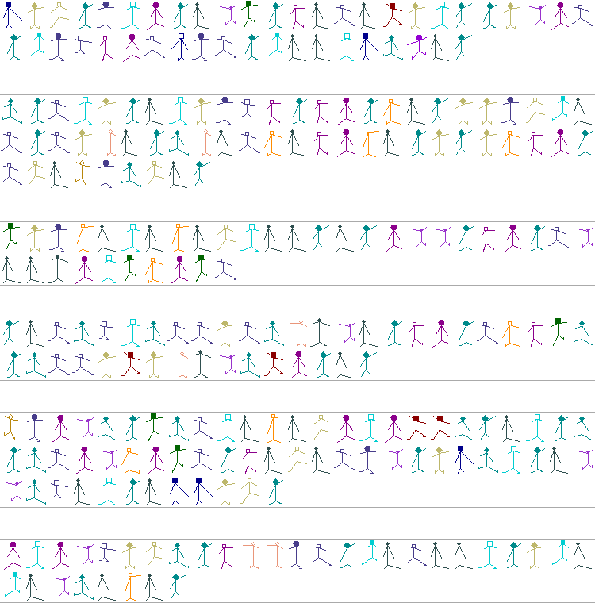

## The Adventure of the Dancing Men

Sherlock Holmes has been seated for some hours in silence in front of his monitor solving a particularly tricky problem.
Once he has cracked it, he got up and went to the window for a short break. A man in the street has caught his eye:
he clearly was looking for an address by checking each house on the even side of the street in turn. 
When the man reached the dead-end and turned back, now checking each house on the odd side of the street, Holmes smiled and returned to his armchair.

A few minutes later a knock came on the door, and the man Holmes just watched entered the room. 

"Welcome, welcome, my friend, sit down and tell me how can I help a fellow TopCoder member," - Holmes greeted him before he started to speak.

"But... Mr. Holmes, how on earth do you know that I'm a TopCoder member?" - the visitor asked in astonishment.

"Oh, that was quite simple. First, I observed you walking the street: you evidently didn't know where my house was, and yet you didn't ask for directions 
but looked for it using - what was it, DFS? Second, you nearly tripped over a box near the door, and the look in your eyes was "wow, that would make a GREAT problem".
Oh, and your TCO'09 t-shirt is quite a giveaway on its own."

The visitor looked down at himself and laughed heartily.

"Ok, Mr. Holmes, you got me. I'm just too puzzled with the question I seek your help with to pay attention to details, like you do. 
You see, my wife is also a TC member, and lately she has been receiving weird letters from TC. She doesn't explain them, but I want 
to know what they mean. So far there are six letters, and here they are."

Holmes examined the letters for some time.

"This promises to be a most interesting and unusual case," - he muttered...

### Hints and Solution

Hint 1

The story wrapper is a hint for the encoding used.

Hint 2

The unofficial motto for the Marathon competition is "You've never needed all that sleep, anyways".

Solution

There are two ways to solve this puzzle. 

The hard way, codenamed "frequency analysis", uses the good old Holmes-style technique:
<ul>
<li>guess that the mottos are encoded using substitution cipher (as hinted by the story
chosen to frame the puzzle), so each man stands for one letter;</li>
<li>calculate the frequencies of each man, and guess that the most frequent letter is 'E';</li>
<li>do further analysis using either next most frequent letters or dictionary guesses;
look either for most frequent bigrams 'TH' and 'ED' or for some words which are likely 
to be used in mottos ('algorithm','design','intelligent' etc.).</li>
</ul>

The easy way, codenamed "motto hint", uses the second hint.
In the real puzzle contest I gave plaintext motto for Marathon track in my "Meet the Bloggers" post.
Each line of code has a different number of characters in it, so a fast counting reveals 
that third line encodes this motto. The rest of letters is mapped trivially.

And finally, the correct answer: the mottos for different competition tracks in order of appearance in the puzzle.
<ul>
<li>Mod Dash: Fortunately, the second-to-last bug has just been fixed (Ray Simard)</li>
<li>Development: It's not enough that we do out best, sometimes we have to do what's required (Winston Churchill)</li>
<li>Marathon: You've never needed all that sleep, anyways</li>
<li>Studio: Design is so simple, that's why it is so complicated (Paul Rand, graphics designer)</li>
<li>Design: Quality is never an accident; it is always the result of intelligent effort (John Ruskin)</li>
<li>Algorithm: An algorithm must be seen to be believed (Donald Knuth)</li>
</ul>

